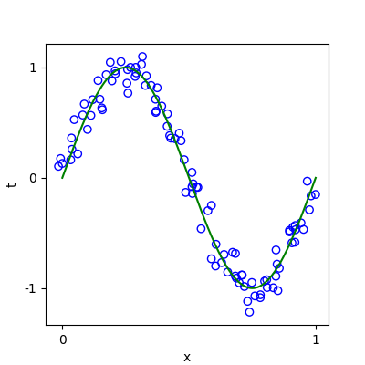
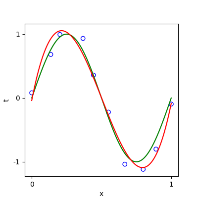
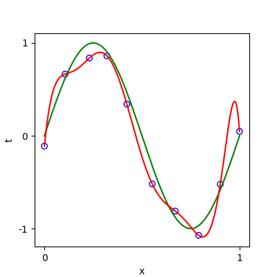
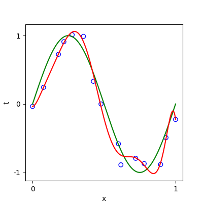
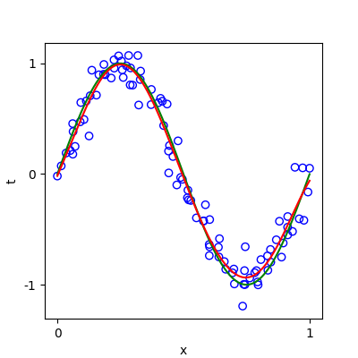
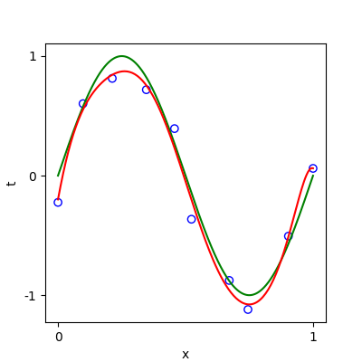
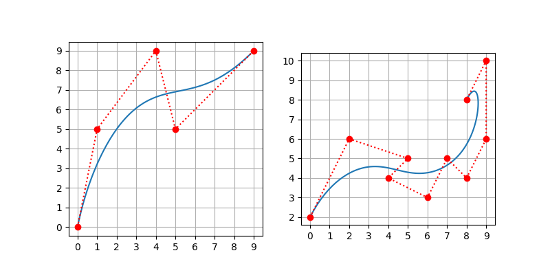

# HW01 Regression and Curve Fitting

## Environment
* Python 3.9
* Jupyter Notebook
* numpy, matplotlib

## A. Basic Goal
### 1. Sample the function curve of y=sin(x) with Gaussian noise

### 2. Fit degree 3 and 9 curves in 10 samples
<figure class="half">
    
    
</figure>

### 3. Fit degree 9 curves in 15 and 100 samples
<figure class="half">
    
    
</figure>

### 4. Fit degree 9 curve in 10 samples but with regularization term

## B. Advanced Goal
