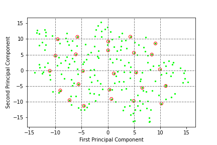

# HW02 Visualization of Hand-written Digits

## Environment
* Python 3.9
* Jupyter Notebook
* numpy, matplotlib
* pytorch 1.12+

## Basic Goal
* First extract target data from the original datasets:  
      
* Do PCA and visualize the eigen feature of all '3's:  
      
* Visualize 2 principal components and the corresponding '3's:  
<figure class="half">
    
    
</figure>

## Advanced Goal
Apply t-SNE to all '3's and extract 2 principal components.  
The data has been dimensionally reduced by a simple PCA into 10 components.  
The training loss curve:  

<figure class="half">
    
    
</figure>
