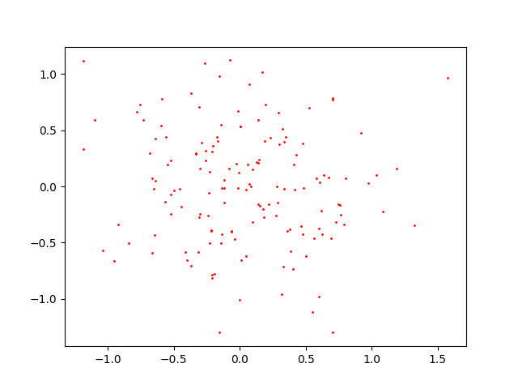
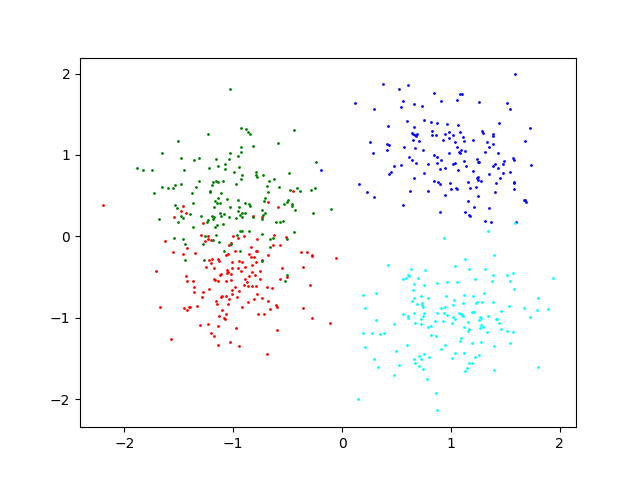

# HW03 Data Clustering

## Environment
* Python 3.9
* Jupyter Notebook
* numpy, matplotlib

## Basic Goal
1. Implement the mean-shift algorithm.

* Generate sampling points from a 2D Gaussian distribution  
      
* Generate sampling points from a 2D Mixture of Gaussian (MOG) distribution
* Generate data via MoG  
      

2. Estimate of generated data via step2 by using the Mean-Shift method
* Plot the clustering results  
    

## Advanced Goal
* Implement the EM algorithm of MoG in 2-D case  
      

For more details, please check HW03.ipynb.
