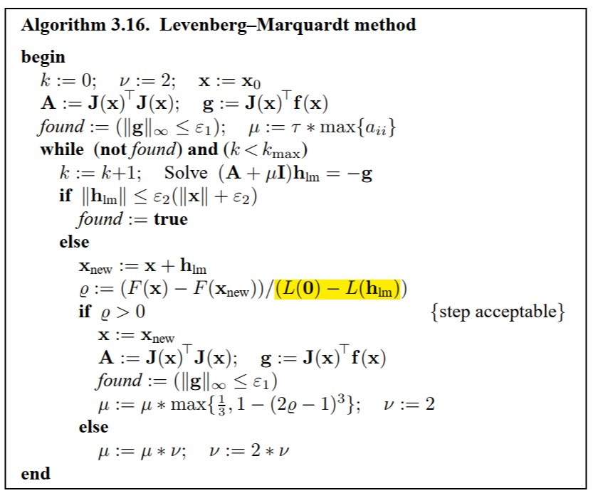
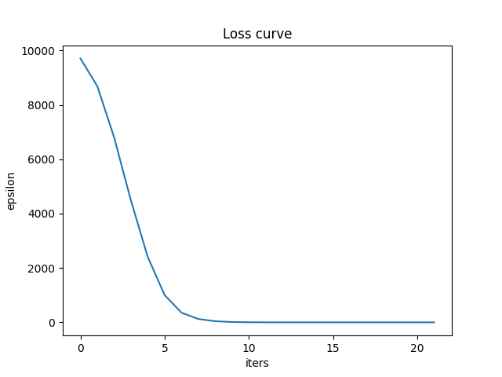
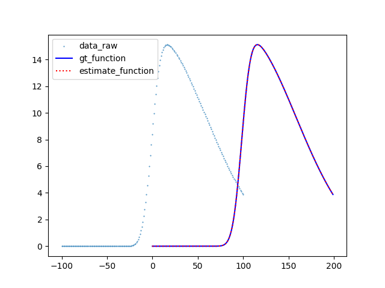

# HW04 L-M Algorithm

## Environment
* Python 3.9
* Jupyter Notebook
* numpy, matplotlib
* pytorch 1.12+

## Goal
Implement the Levenberg-Marquardt algorithm  

* Design your own test functions, two variable functions are highly recommended.
* Plot the iteration steps

## Algorithm

Our task is to minimize the target function：  
$$
\epsilon_{\bold p}=||\bold x-f(\bold p)||^2
$$  
We select an mix-gaussian function for $f(\cdot)$, which contains 4 controllable parameters: norm, mean, sigma, skew(eta).  
$$
\bold H = \bold J^\top\bold J,\quad\bold g=\bold J^\top\epsilon_{\bold p}
$$  
In each iteration, we solve a equation by using least square algorithm:  
$$
(\bold H+\mu\bold I)\delta_{\bold p}=\bold g
$$  
The stop condition is decided by $\bold g,\bold p,f$.  
The pseudo code is given below:

  

