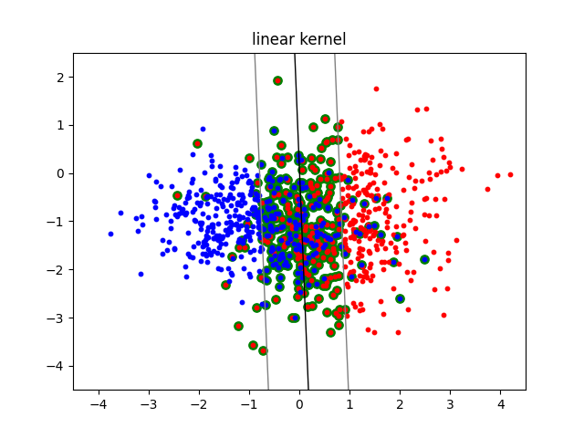
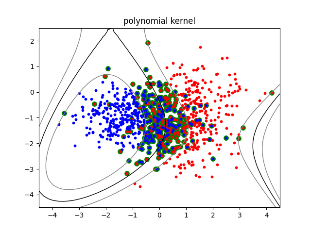

# Homework 05
  
## Goal

Implement the SVM algorithm 

+ Generate sampling points from 2 classes with non-linear distributions (in 2D) 
+ Apply kernel functions for the classification modeling: linear kernel, Gaussian kernel or other kernels
+ Solve the problem by using QP (quadratic programming) via the active set method
+ Plot the classification results

## Requirements

+ Programming lanuage: [python3](https://docs.python.org/3/tutorial/)
+ Optional package: [tensorflow web](https://www.tensorflow.org/)
+ Plot the results in [matplotlib](http://matplotlib.org/) [Introduction in Chinese](http://www.ibm.com/developerworks/cn/linux/l-matplotlib/index.html) [Tutorial](http://www.ast.uct.ac.za/~sarblyth/pythonGuide/PythonPlottingBeginnersGuide.pdf)

## Bonus

+ implement other efficient QP algorithms 

## References
+ http://cvxopt.org
+ http://www.csie.ntu.edu.tw/~cjlin/libsvm/

## Results
1. Original Data  
  
2. SVM w/ linear kernel  

3. SVM w/ polynomial kernel  

4. SVM w/ gaussian kernel  
